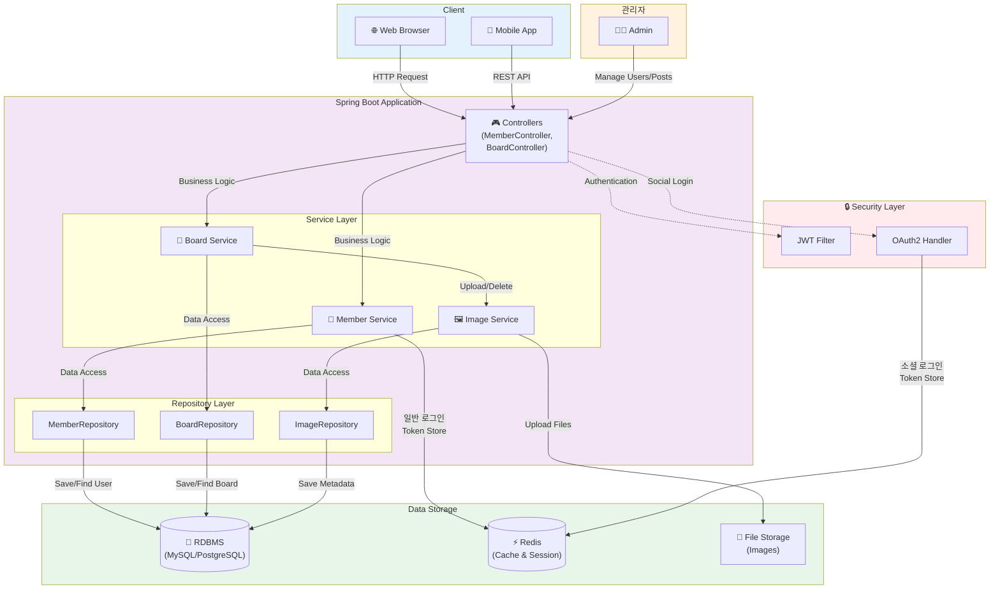

# 시스템 아키텍처

## 전체 시스템 구조



## 계층별 설명

### 1. Client Layer (클라이언트 계층)
- **웹 브라우저**: 데스크톱 및 모바일 웹 환경에서 접근
- **모바일 앱**: 네이티브 또는 하이브리드 앱에서 REST API 호출

### 2. Controller Layer (컨트롤러 계층)
- **MemberController**: 회원 가입, 로그인, 프로필 관리 엔드포인트
  - `POST /api/member/signup` - 회원가입
  - `POST /api/member/login` - 로그인
  - `POST /api/member/refresh` - 토큰 갱신
  - `POST /api/member/logout` - 로그아웃
- **BoardController**: 게시글 작성, 조회, 수정, 삭제 엔드포인트
- HTTP 요청을 받아 적절한 서비스로 라우팅

### 3. Service Layer (서비스 계층)
- **MemberService**: 회원 관련 비즈니스 로직 처리
  - 회원 가입/로그인 처리
  - JWT 토큰 생성 및 Redis 저장
  - 토큰 갱신 및 로그아웃 처리
- **BoardService**: 게시판 관련 비즈니스 로직 처리
  - 게시글 CRUD
  - 해시태그 관리
  - 좋아요 기능
- **ImageService**: 이미지 업로드/삭제 로직 처리
- 트랜잭션 관리 및 비즈니스 규칙 적용

### 4. Repository Layer (리포지토리 계층)
- **MemberRepository**: 회원 데이터 CRUD 작업
  - `@EntityGraph`를 활용한 Role 즉시 로딩
- **BoardRepository**: 게시글 데이터 CRUD 작업
  - `@EntityGraph`를 활용한 이미지, 해시태그 즉시 로딩
  - N+1 문제 해결
- **ImageRepository**: 이미지 메타데이터 CRUD 작업
- JPA를 통한 데이터베이스 접근 추상화

### 5. Security Layer (보안 계층)
- **JWT Filter**: JWT 토큰 기반 인증 필터
  - 요청 헤더에서 토큰 추출
  - 토큰 유효성 검증
  - SecurityContext에 인증 정보 설정
- **OAuth2 Handler**: 소셜 로그인 (카카오, 구글 등) 처리
  - OAuth2 인증 성공 후 JWT 토큰 생성
  - Redis에 토큰 저장
- Spring Security를 통한 인증/인가 관리

### 6. Storage Layer (저장소 계층)
- **RDBMS**: 주요 데이터 영구 저장 (MySQL/PostgreSQL)
  - Member, Board, Image, HashTag, Favorite 등
- **Redis**: RefreshToken 저장 및 세션 캐싱
  - Key: 사용자 이메일
  - Value: RefreshToken
  - TTL: 7일
- **File Storage**: 이미지 파일 저장소

### 7. Admin (관리자)
- 사용자 및 게시글 관리
- 시스템 모니터링 및 설정

## 주요 데이터 플로우

### 1. 일반 회원가입/로그인 플로우
```
Client → MemberController.login()
       → MemberService.login()
       → MemberRepository.getWithRoles(email) → DB 조회
       → 비밀번호 검증 (PasswordEncoder)
       → JWT AccessToken, RefreshToken 생성
       → Redis에 RefreshToken 저장 (key: email, TTL: 7일)
       → Client에 응답 (AccessToken + RefreshToken 쿠키)
```

**코드 위치:**
- `MemberServiceImplement.java` 60-74번 줄

### 2. OAuth2 소셜 로그인 플로우
```
Client → OAuth2 Provider (Kakao/Google)
       → OAuth2 인증 성공
       → CustomOAuth2UserService
       → OAuth2LoginSuccessHandler
       → JWT AccessToken, RefreshToken 생성
       → Redis에 RefreshToken 저장
       → Redirect with Token
```

**코드 위치:**
- `handler/OAuth2LoginSuccessHandler.java`
- `service/oauth/CustomOAuth2UserService.java`

### 3. 게시글 작성 플로우
```
Client → BoardController.createBoard()
       → BoardService.createBoard()
       → 이미지 처리: ImageService.uploadImages()
       → 해시태그 처리: HashTag 엔티티 생성/조회
       → BoardRepository.save() → DB 저장
       → ImageRepository.save() → DB 저장
       → File Storage에 이미지 파일 업로드
```

### 4. 인증 플로우 (JWT)
```
Client (with JWT in Header: Authorization: Bearer xxx)
       → JwtAuthenticationFilter
       → JwtTokenProvider.validateToken()
       → JwtTokenProvider.getEmailFromToken()
       → CustomUserDetailsService.loadUserByUsername()
       → SecurityContext에 인증 정보 설정
       → Controller 실행
```

**코드 위치:**
- `filter/JwtAuthenticationFilter.java`
- `util/JwtTokenProvider.java`

### 5. 토큰 갱신 플로우
```
Client (with RefreshToken in Cookie)
       → MemberController.refresh()
       → MemberService.refresh()
       → Cookie에서 RefreshToken 추출
       → 토큰 유효성 검증
       → Redis에서 저장된 RefreshToken 조회
       → 토큰 일치 확인
       → 새로운 AccessToken 생성
       → Client에 응답
```

**코드 위치:**
- `MemberServiceImplement.java` 86-116번 줄

### 6. 로그아웃 플로우
```
Client → MemberController.logout()
       → MemberService.logout()
       → AccessToken에서 이메일 추출
       → Redis에서 해당 RefreshToken 삭제
       → RefreshToken 쿠키 삭제
```

**코드 위치:**
- `MemberServiceImplement.java` 119-126번 줄

## 기술 스택

### Backend
- **Framework**: Spring Boot 3.x
- **Security**: Spring Security, JWT, OAuth2
- **ORM**: JPA/Hibernate
- **Database**: MySQL/PostgreSQL
- **Cache**: Redis (StringRedisTemplate)
- **Build Tool**: Gradle
- **API Documentation**: Swagger

### 주요 라이브러리
- `jjwt` - JWT 토큰 생성/검증
- `spring-boot-starter-data-redis` - Redis 연동
- `spring-boot-starter-oauth2-client` - OAuth2 소셜 로그인

## 도메인 모델

### Member (회원)
- **필드**: id, email, password, nickname, profileImage
- **관계**: 
  - `@ElementCollection`: MemberRole (USER, ADMIN)
  - `@OneToMany`: Board, Favorite
- **특징**: `@ElementCollection`으로 별도 엔티티 없이 Role 관리

### Board (게시글)
- **필드**: id, title, content, viewCount
- **관계**:
  - `@ManyToOne`: Member (작성자)
  - `@OneToMany`: Image
  - `@ManyToMany`: HashTag (중간 테이블: board_hashtag)
  - `@OneToMany`: Favorite
- **특징**: Board가 연관관계 주인 (해시태그, 이미지 관리 주도)

### Image (이미지)
- **필드**: id, fileName, filePath
- **관계**: `@ManyToOne`: Board

### HashTag (해시태그)
- **필드**: id, tagName
- **관계**: `@ManyToMany`: Board

### Favorite (좋아요)
- **복합키**: (memberId, boardId)
- **관계**: `@ManyToOne`: Member, Board

## 아키텍처 특징

### 1. 계층형 아키텍처 (Layered Architecture)
- **명확한 책임 분리**: Controller → Service → Repository
- **의존성 방향**: 상위 계층이 하위 계층에 의존
- **테스트 용이성**: 각 계층을 독립적으로 테스트 가능

### 2. RESTful API 설계
- HTTP 메서드 활용 (GET, POST, PUT, DELETE)
- 리소스 중심 URL 설계
- 상태 코드 기반 응답 처리

### 3. JWT 기반 Stateless 인증
- **AccessToken**: 짧은 만료 시간 (예: 1시간)
- **RefreshToken**: 긴 만료 시간 (7일), HttpOnly 쿠키로 전송
- Redis에 RefreshToken 저장하여 강제 로그아웃 가능
- 확장성 확보 (세션 불필요)

### 4. 소셜 로그인 지원
- OAuth2 프로토콜 활용
- 카카오, 구글 등 다양한 Provider 지원
- 일반 로그인과 동일한 JWT 토큰 체계

### 5. N+1 문제 해결
- `@EntityGraph`를 활용한 Fetch Join
- 연관 엔티티 즉시 로딩으로 성능 최적화

### 6. Redis 캐싱 전략
- RefreshToken 저장 (TTL: 7일)
- 세션 관리 및 성능 최적화

### 7. 파일 업로드 처리
- 이미지 파일: File Storage에 저장
- 메타데이터: DB에 저장
- 파일명 중복 방지 (UUID 활용)

## 보안 고려사항

### 1. 비밀번호 암호화
- `PasswordEncoder` (BCrypt) 사용

### 2. JWT 보안
- AccessToken: Authorization 헤더로 전송
- RefreshToken: HttpOnly 쿠키로 전송 (XSS 방지)

### 3. CORS 설정
- Spring Security Config에서 허용된 Origin 설정

### 4. 권한 기반 접근 제어
- `@PreAuthorize` 어노테이션 활용
- Role 기반 접근 제어 (USER, ADMIN)

## 확장 가능성

### 1. 마이크로서비스 전환 가능
- 각 도메인이 명확히 분리되어 있어 서비스 분리 용이

### 2. 캐싱 레이어 추가
- Redis를 활용한 조회 쿼리 캐싱

### 3. 메시징 큐 도입
- 이미지 처리, 알림 발송 등 비동기 처리

### 4. CDN 연동
- 이미지 파일 전송 성능 향상

## 개발 가이드

### 다이어그램 확인 방법

1. **GitHub에서 보기**
   - 파일을 커밋하고 GitHub에 푸시하면 Mermaid 다이어그램이 자동으로 렌더링됩니다.

2. **IntelliJ IDEA에서 보기**
   - IntelliJ에 Mermaid 플러그인 설치
   - `Settings` → `Plugins` → "Mermaid" 검색 → 설치
   - 파일을 열면 미리보기 가능

3. **VS Code에서 보기**
   - Markdown Preview Mermaid Support 확장 설치
   - `Ctrl+Shift+V`로 미리보기

4. **온라인 에디터**
   - https://mermaid.live 에서 코드를 복사하여 실시간 확인

### API 문서 확인
- Swagger UI: http://localhost:8080/swagger-ui/index.html
